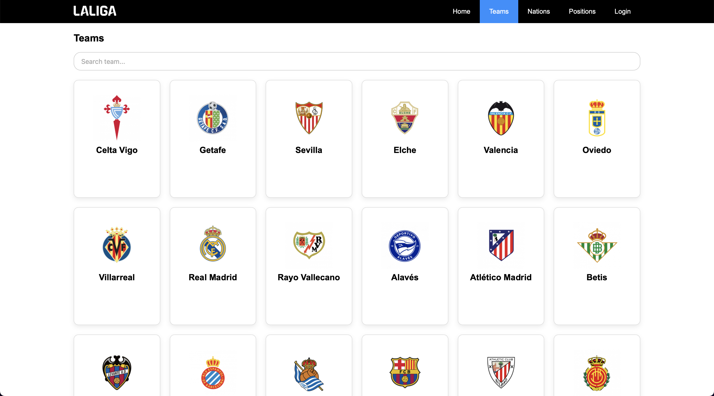
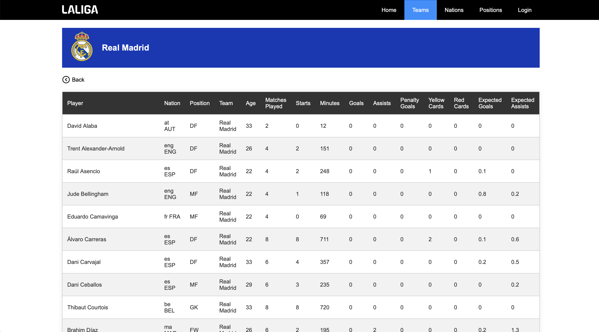
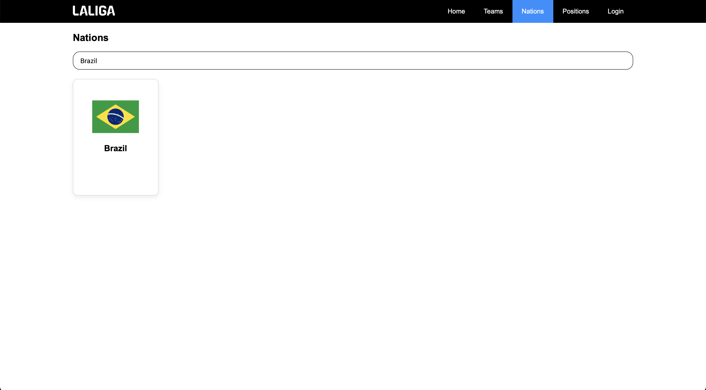
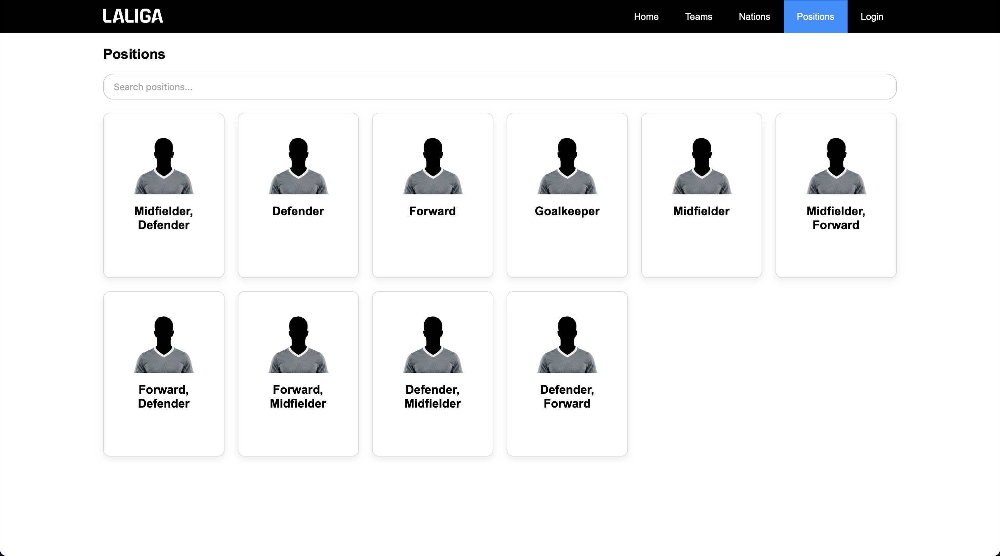
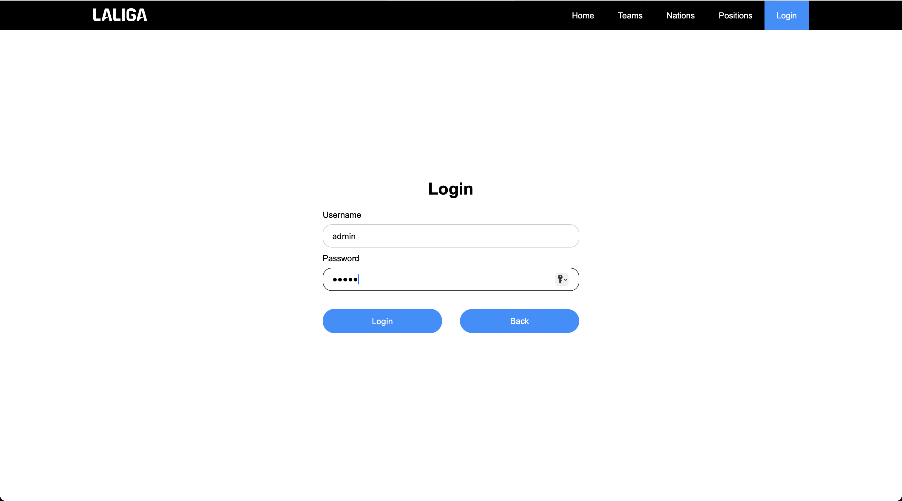
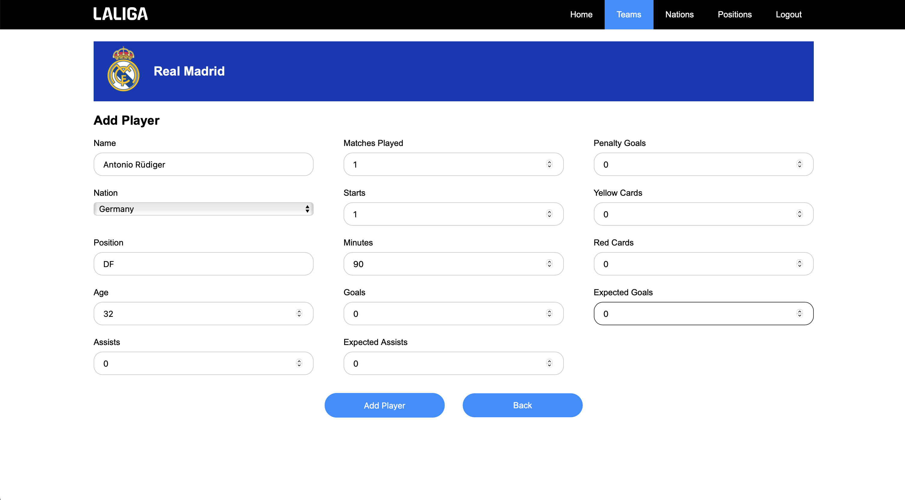
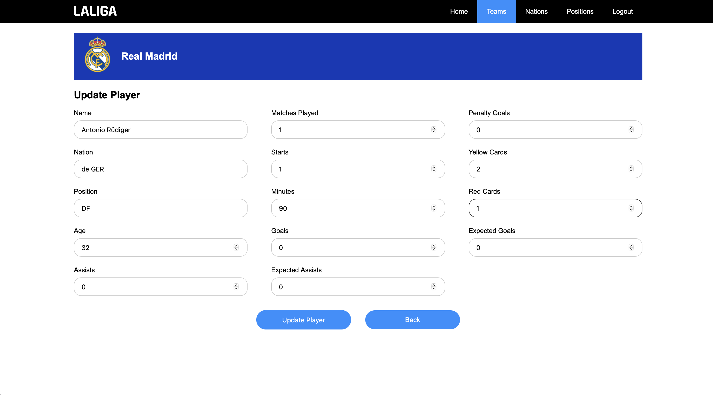
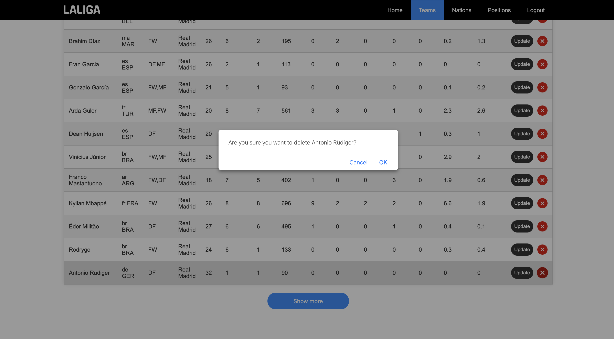

# La Liga Zone

Full-stack application for managing La Liga players, teams, and nations.

## Overview
La Liga Zone is a full-stack web application for exploring and managing La Liga football players. The application provides dedicated pages for teams, nations, and positions, allowing users to easily browse and find players based on different categories.

Users can explore all La Liga teams and select a team to view its players. The Nation page allows users to select a nation and view all players from that nation, while the Position page allows users to select a position, such as GK (Goalkeeper), DF (Defender), MF (Midfielder), or FW (Forward), and view all players in that position. Each of these pages includes a search bar to help users quickly find the information they are looking for.

The application also includes a homepage and an admin login system. Authenticated administrators can create, update, and delete player information through the application.

The project was built using React for the frontend, Spring Boot for the backend, and PostgreSQL for data storage. It demonstrates the integration of a REST API with a React frontend and provides functionality for browsing, searching, filtering, and managing player data.

## Features
- **Homepage** — Provides an introduction and navigation to the main sections of the application.
- **Team Browser** — Browse all La Liga teams and select a team to see its players.
- **Nation Browser** — Browse available nations and select a nation to see all players from that nation.
- **Position Browser** — Browse players by position category: GK (Goalkeeper), DF (Defender), MF (Midfielder), and FW (Forward).
- **Search** — Search and filter players within the Team, Nation, and Position pages.
- **Player Management** — View detailed player information.
- **Admin Authentication** — Admin users can log in through a login page.
- **Admin Player Management** — Authenticated admins can create, update, and delete player information. 

## Technologies
- Java 21
- Spring Boot
- React
- JavaScript
- PostgreSQL
- HTML5
- CSS3

## Project Structure
- `backend/src/main/java/com/ll/laliga_zone/controller` — MVC controllers, including `PlayerController`.
- `backend/src/main/java/com/ll/laliga_zone/service` — Business logic and service layer.
- `backend/src/main/java/com/ll/laliga_zone/repository` — Spring Data JPA repositories.
- `backend/src/main/java/com/ll/laliga_zone/model` — JPA entities: `Player`, `Admin`.
- `backend/src/main/java/com/ll/laliga_zone/security` — Security configuration.
- `backend/src/main/java/com/ll/laliga_zone/exception` — Exception handling.

- `frontend/src/api` — API functions for communicating with the Spring Boot backend, including retrieving, filtering, creating, updating, and deleting player data.
- `frontend/src/components` — Reusable React components for displaying teams, nations, positions, and player information, as well as navigation, authentication, and player management.
- `frontend/src/hooks` — Custom React hooks for fetching player data and managing loading and error states, including players filtered by team, nation, or position.
- `frontend/src/pages` — Main application pages, such as Home, Team, Nation, Position, and Login pages.
- `frontend/src/utils` — Shared data and utility functions for nation and position names, player form validation, team colors, and team logos.

## API Endpoints

| Method | Endpoint | Description |
|---|---|---|
| GET | `/api/players` | Get all players |
| GET | `/api/players?team={team}` | Get players by team |
| GET | `/api/players?nation={nation}` | Get players by nation |
| GET | `/api/players?position={position}` | Get players by position |
| GET | `/api/players/{id}` | Get a player by ID |
| POST | `/api/players` | Add a new player |
| PUT | `/api/players/{id}` | Update a player |
| DELETE | `/api/players/{id}` | Delete a player |

## Getting Started

### Prerequisites

Make sure you have the following installed:

- Java 21
- Node.js and npm
- PostgreSQL

### Database Configuration

The backend uses the `DB_PASSWORD` environment variable to connect to PostgreSQL.

Before running the backend, set `DB_PASSWORD` to your PostgreSQL password:

```bash
export DB_PASSWORD=your_postgresql_password
```

Replace `your_postgresql_password` with your own PostgreSQL password.

### Installation

1. Clone the repository:

```bash
git clone https://github.com/freddyhiga/laliga-zone.git 
cd laliga-zone
```

2. Configure the PostgreSQL database:

Create a database named `laliga_db` and configure the database credentials in the backend environment.

3. Start the backend:

```bash
cd backend 
./mvnw spring-boot:run
```

The backend will run on `http://localhost:8080`.

4. In a new terminal, start the frontend:

```bash
cd frontend 
npm install 
npm run dev
```

The frontend will run on `http://localhost:5173`.

## Screenshots

### Homepage 
 

### Teams 
 

### Team Details
 

### Nations 
 

### Positions
 

### Login 
 

### Add Player
 

### Update Player
 

### Delete Player
 


